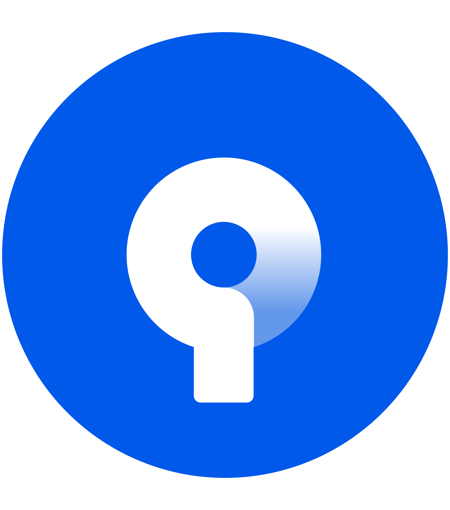

# Hello! I'm Syntriax!

## I'm a Unity Developer with a bachelor in Computer Engineering
I have interests in Game Development, Storytelling and Art in general. 
Developed many games using Unity and Desktop Applications for Windows since 2012. I usually put my code that I don't care too much about on Github, most of my codebase is over at my own git server.

 

### Games Published

 
 
 

### Tools

 
 
 

### Main Programming Languages

 
 

##### Other Languages

 
 

### Technologies

 
 

### External Links

